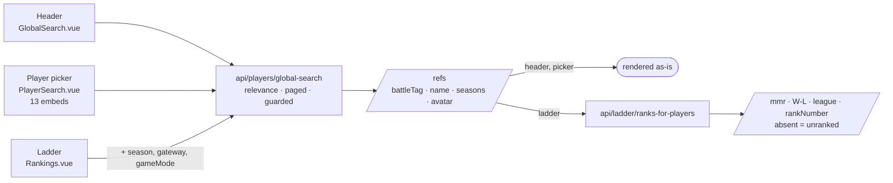

# Player search consolidation

One search core serves every place the site looks a player up by name. Rank data is a separate
follow-up call, made only where a ladder is on screen.

- [Shape](#shape)
- [Relevance](#relevance)
- [Paging](#paging)
- [Guards](#guards)
- [Consumers](#consumers)
- [Rollout and rollback](#rollout-and-rollback)
- [Rank storage and lookup](#rank-storage-and-lookup)
- [Retirement](#retirement)

> Render the diagrams with VS Code's Mermaid preview, GitHub, or
> `npx @mermaid-js/mermaid-cli -i docs/PLAYER_SEARCH_CONSOLIDATION.md -o search.svg`.

## Shape

`api/players/global-search` is the core (`PlayersController.cs:46` →
`PlayerService.GlobalSearchForPlayer`, `Services/PlayerService.cs:89`). It matches the search text
against the PersonalSettings directory held in memory, orders by relevance, and returns a page of
refs: battleTag, name, seasons and avatar. It pages by cursor and validates its own input, so those
guards live in one place instead of in each caller — see [Guards](#guards).

Rank is not part of a ref. A caller with a ladder on screen follows up with
`POST api/ladder/ranks-for-players`, which annotates the page it just received with rank in one
season, gateway and game mode. A player missing from that response holds no rank there.

The two searches this replaces, `api/players/?search=` (`PlayersController.cs:134`) and
`api/ladder/search` (`LadderController.cs:29`), stay live and unmodified. A frontend flag chooses
between them and the core.

**The directory decides who can be found** — the one change in *which* players a search can return.
The core looks names up in the settings collection, a record per player who has settings; the
searches it replaces looked in the stats collection, a record per player who has finished a game.
Most players are in both — 47,141 in a 2022 snapshot — but 5,193 exist only in the stats collection
and stop being findable, while 4,615 exist only in the settings collection and become findable for
the first time. Which of the two a name search ought to mean is a question of its own; this design
takes the answer the core already gave.

**Enrichment is a lookup, not a second search.** It takes the exact battleTags the core returned.
Partial-name matching happens once, in the core.

### What each call asks

|  | `global-search` | `ranks-for-players` |
|---|---|---|
| Question | which matches are on this ladder, and where do they stand | for these exact players, what do I display |
| Scope | the whole match set — standing decides the page cut | the ≤20 tags the core returned |
| Reads | `RankingPoints` | mmr, W-L, games, race, league, rankNumber |
| Backed by | `RankRepository.LoadLadderStandings` | `RankRepository.LoadRanksForPlayers` (`:279`) |
| Returns | ordering, encoded in `relevanceId` | the rank rows |

`LoadLadderStandings` exists so the ordering query fetches only the one field it actually reads.
Both queries `$lookup` `PlayerOverview` and drop ranks that fail to join. The join is what keeps the
two calls in agreement on who counts as ranked: orphaned ranks are real — 379 in season 13 / 2v2
AT — and an ordering query that skipped the join would sort them into the ranked block while
enrichment returned nothing for them.

The split reads the same rank rows twice — once for each match's standing, to decide who appears,
and once for the page's full rows, to display them. One request could do both, by having the
directory search return rank data itself when given a ladder. That would make its response shape
depend on the context it was called with, and the context-free response is exactly what the launcher
and the header already consume — keeping the two apart is what lets that reply stay byte-for-byte
what it was. It also leaves rank-in-context as an endpoint of its own, usable by anything that has a
list of players and a ladder in mind.

## Relevance

`global-search` takes an optional ladder context: `season`, `gateWay` and `gameMode`, all three or
none. With a context, standing on that ladder is part of relevance. Without one, results are ordered
by name alone and are byte-identical to what the endpoint returned before this change.

A request carrying one or two of the three is rejected. The `relevanceId` doubles as the pagination
cursor and its layout differs between the two modes, so a caller who dropped a parameter between
pages would compare keys from two different namespaces.

**The context has to reach the core.** Filtering a name-ordered page afterwards is too late: how well
a name matches says nothing about being ranked, so the first page of name matches misses most of the
ranked players. Searching `man` on season 13 / EU / 1v1 matches 766 players, 55 of them ranked, and a
name-ordered page of 20 reaches none of them. Ordered by standing it reaches 20.

Ordering ranked-first within each name tier does not fix it either. The tiers are larger than a page,
so a page runs out inside an early tier and every ranked player below that point is lost.

### The sort key

The key is also the cursor, so it is compared as a string.

| Block | Key |
|---|---|
| No context | `{tier}_{battleTag}` |
| Ranked in context | `0_{99999 − round(RankingPoints × 100):D5}_{battleTag}` |
| Unranked in context | `1_{tier}_{battleTag}` |

Ranking points are the ladder's own ordering, monotone and contiguous across every league and
division. The other rank fields are not: league ids follow creation order, so a division added
mid-season files below leagues it outranks, and `RankNumber` restarts at 1 in every league.
`LeagueName` is null on every stored rank and `LeagueOrder` is inconsistently populated.

String comparison ascends, so higher points have to encode smaller — hence the complement. It is
scaled by 100 to keep the ladder's 0.1-point precision, zero-padded because the comparison is
lexical, and clamped to `[0, 99999]`. Players sharing the points floor fall back to battleTag order.

The ordering has a price: a shared name can push its owner down the list. Someone of modest rank
whose name is contained in the names of twenty better-ranked players is not at the top of the
results for that name — typing the full battleTag goes straight to them, and scrolling reaches them
otherwise. Putting exact matches first would not repair it: it cannot tell two players with the same
name apart, and it would cost the best-players-first ordering on every other search.

## Paging

The core is cursor-paged. A caller reaching the end of the list asks for the next page with the last
row's `relevanceId`, and the ladder runs a fresh enrichment call for each page it receives. The list
loads further pages by itself as it is scrolled, which is how a context search reaches its unranked
matches: they file behind every ranked one.

Every page of one search carries the same ladder context — a cursor minted in one key layout cannot
page against the other.

## Guards

A server guard holds for every caller, including the two clients outside the website. A client guard
protects one surface only. So anything defending the database or the response contract belongs on the
server, and the client guards are the ones about typing.

The server guards live in `PlayersController.cs:59` onwards and in the repository:

| Guard | Behaviour |
|---|---|
| Three letters or digits | 400. Counted over letters and digits rather than raw length, because matching is culture-sensitive: three zero-width characters measure three long and are contained in every battleTag, and with a ladder context that turns one request into a standings lookup for the whole directory. |
| Ladder context complete | 400 when one or two of `season`, `gateWay`, `gameMode` arrive without the others, rather than honouring them partially. The cursor layouts differ between the two modes, so a caller dropping a parameter between pages would page against keys from the other namespace and silently get nothing. |
| `pageSize` capped at 20 | Clamped, not rejected. `launcher-e` sends 10 and infers a further page from receiving exactly 10, so rejecting an oversized value would break a shipped client's paging. |
| Enrichment batch bounded | `ranks-for-players` answers an empty list with `[]` and refuses more than 50 battleTags, keeping the anonymous route's `$in` small. |
| Ranking points clamped | The sort key clamps to `[0, 99999]`, so a stored value outside the ladder's range cannot produce a malformed cursor. |
| Ranked means joined | Both rank queries drop rows whose `PlayerOverview` is missing, so ordering and enrichment agree on who counts as ranked. |

The server guards assume an anonymous caller, because that is what these routes have: none of them
need a login, on either path, so the player directory can be collected from any of them — the legacy
searches hand back every match at once, the core twenty at a time with a pointer to the next.
Retiring the legacy routes removes the quicker way of doing it, not the possibility.

The client guards live in `PlayerSearch.vue` and the ranking store. Three of them repair defects
that predate this work and are visible on the legacy path too: the `#` encoding, the debounce
cancel, and the scroll sentinel — which used to load the header's entire result list, page after
page, the moment the menu opened:

| Guard | Behaviour |
|---|---|
| Debounce 500ms, three characters | The flow fires about once per typing pause rather than per keystroke. |
| Debounce cancelled on clear | Deleting below three characters cancels the armed timer. Without it the timer fires a search for text that is no longer in the box and repopulates a cleared list. |
| Newest search wins | A monotonic ticket is checked after every await, twice on the ladder's two-call path. Clearing bumps it, so a reply already in flight cannot repopulate an empty box. |
| `#` encoded | `encodeURIComponent` on both the search term and the cursor. A raw `#` starts a URL fragment and the rest of the query never reaches the server. |
| A failed page cannot wedge the list | The append awaits inside `try`/`finally`, so a rejected request still clears the loading flag — which also gates the scroll sentinel, and would otherwise block every later append. |
| Sentinel bound to its own list | The observer resolves the list it belongs to and appends only within 120px of that list's scrolled end, so a sentinel flashing into view during layout does not page. |

## Consumers

| Surface | Context it can offer | Enrichment |
|---|---|---|
| Header, `GlobalSearch.vue` | none | none — avatar and seasons are already in the ref |
| `PlayerSearch.vue`, 13 embeds across 12 files | none | none — rows show the ref's avatar and seasons, and selection yields a battleTag |
| Rankings, `Rankings.vue` | season, gateway, game mode, all on screen | rank in that context |

The header and the picker have no ladder in view to pass. Rankings is the only surface that renders
one, which is why the context is defined by what is on screen, not by which surface is calling.

**The core does not serve match-scoped search.** "Who have I played" is a question about a
relationship, not about the directory, and it carries per-pair data the directory has no notion of.
It has its own endpoint. `PlayerSearch.vue` picks the source per embed.

Two clients outside the website call these endpoints directly:

| Client | Calls | What it constrains |
|---|---|---|
| `launcher-e` (Tauri, active) | `global-search`, `player-search.service.ts:48` | Reads `battleTag`, `relevanceId`, `profilePicture.{race,pictureId,isClassic}` and `seasons[].id`. Sends `pageSize=10` and infers a further page from receiving exactly 10, so `pageSize` must be honoured rather than substituted. |
| In-game UI bundle, `storage.w3champions.com/{env}/integration/w3champions.js` | `ladder/search`, from `StatisticsClient.prototype.searchRankings` | A live call, shipped by the deprecated Electron launcher. Its source repository has not been identified. |

`launcher-e` is unaffected: the context-free response is unchanged.

## Rollout and rollback

The frontend carries the flag, because it is the side with two code paths. `USE_NEW_SEARCH` is
runtime config read from the deployed `public/env.js`, so flipping it needs no rebuild. The backend
has no flag; it serves both endpoint sets and lets the frontend choose.

1. **Backend first.** The new endpoints go live, the legacy ones are untouched, and nothing calls the
   new ones yet. Deploying the frontend first would fail hard rather than gracefully: the `POST`
   would match the `GET {leagueId}` route, get a 405 with an empty body, and the parse would throw
   inside a debounce timer, leaving the spinner up.
2. **Frontend next.** The flag reads `window._env_.USE_NEW_SEARCH ?? true` and production's `env.js`
   carries no such key, so merging the frontend *is* the rollout.
3. **Rollback.** Add `USE_NEW_SEARCH: false` to production's `env.js`. The legacy paths are still
   there, unmodified, which is what makes the fallback trustworthy.

**Verifying the backend deploy.** Three checks against the freshly rolled backend:

- `db.Rank.getIndexes()` lists `MemberIds_Season_Gateway_GameMode`. The startup-log failure shape
  to watch for is `IndexOptionsConflict`, described under
  [Rank storage and lookup](#rank-storage-and-lookup).
- The backfill job, run once per environment: `POST api/admin/jobs/rank-member-ids-backfill/run`
  (admin runner, `docs/admin-job-runner.md`) reaches `Completed`, its progress trail naming each
  season and the rows it filled.
- `db.Rank.countDocuments({ MemberIds: { $exists: false } })` returns 0 once the job has completed.

The backend stays additive at the API surface. `POST ladder/ranks-for-players` is a new route,
verb-disjoint from the `GET {leagueId}` it sits beside. `LoadRanksForPlayers` gains the ladder
context as an overload, so `ClanCommandHandler` and `ChatDetailsQueryHandler` stay bound to the
season-only original. Every legacy route keeps its path, verb, request and response shape.

## Rank storage and lookup

This design changes one existing production collection, `Rank`, in three ways: the row gains a list
of its members, the collection gains one multikey index over that list, and an admin-triggered
backfill job brings the existing rows up to the new shape.

A rank row is one ladder entry. The new `MemberIds` field (`Rank.cs:60`) lists every member of that
entry; the long-standing `Player1Id` and `Player2Id` keep holding the first two. The list exists for
the lookup alone and stays off the wire — `[JsonIgnore]`, pinned by a contract test — because
serializing it would change the response shape of every legacy endpoint that returns ranks.

The list is what lets an index answer the search's question. A row's id concatenates season, member
tags and mode into one string, and the old ladder search substring-matched it. That finds every
member, but it reads every row and matches the id's structure as readily as the names inside it —
searching `1v1`, `GM_` or `13_` returns the whole ladder, 5,946 rows on season 13 in Europe. The new
search hands the database exact battleTags and asks which of them hold a rank here. With the members
stored as a list of their own, every one of them — third and fourth included — is a key the index
can seek.

| Index | Keys |
|---|---|
| `MemberIds_Season_Gateway_GameMode` | `MemberIds` (multikey), `Season`, `Gateway`, `GameMode` |

Multikey means one index entry per member, which is what makes every member findable. Leading with
the member lets the bounded `$in` seek straight to the matching rows instead of scanning the season
and mode bucket. On a season-13 dataset of 173,571 documents the index adds ~3.5 MB and the member
list grows the documents themselves by ~6.5 MB (49.3 → 55.8 MB measured after a full backfill); the
collection grows with players × seasons × modes × gateways, not with match volume. A context search costs one query against those rows, measured at a few tens of
milliseconds; a search with no context never reaches the database at all — the directory it matches
is held in memory.

**The backfill.** A row written before the field existed would answer "not ranked" forever: a row
only rewrites itself when its league next syncs, which for a finished season never happens.
`RankMemberIdsBackfillJob` fills those rows through the admin job runner
(`docs/admin-job-runner.md`): triggered once per environment via
`POST api/admin/jobs/rank-member-ids-backfill/run`, it works one season per batch, paces between
seasons against database and CPU pressure, and checkpoints the last completed season, so an
interrupted run resumes where it died. Members come from the joined `PlayerOverview`, which
carries the whole team as structured data — teams of three and four are repaired rather than left
at the two members the old fields held: 829 such rows on the 2022 prod dump (536 three-member,
293 four-member, all in seasons 9–13). Rows with no `PlayerOverview` fall back to the two fields;
they are the orphan ranks the lookup drops anyway. Deciding whether a season holds work is a single `$exists` count on the
missing field, which is also what makes the job safe to re-run: a filled row no longer matches, so
a redo finds nothing. The same property makes rollback safe: if an older image runs for a while
and writes rows without the field, re-running the job finds and fills them — there is no marker to
reset. The index stays a startup concern — `RankRepository.EnsureIndexesAsync`, run by
`MongoIndexInitializationService` — so the lookups have their index whether or not the job has
run, and a backfill failure cannot cost them it.

**Who reads the list.** The search pair — `LoadLadderStandings` and the context overload of
`LoadRanksForPlayers` — match on the member list alone, through the shared `OnLadder` predicate,
and the index serves them. `LoadPlayersOfCountry` and the season-only `LoadRanksForPlayers` (clan
and chat) also read the list but keep the two-field match beside it in an `$or`: they sit outside
the rollout flag, so they must keep working on rows the backfill job has not reached. The `$or`
keeps them on the season index they have always used, and the fallback is removed with the legacy
retirement.

**One failure mode.** If production already holds an index with these keys under a different name,
`createIndexes` fails with `IndexOptionsConflict`. The initialization service logs per repository
and continues, so startup still reports success. Results stay correct and the member lookups fall
back to collection scans, visible only in the startup log.

## Retirement

Once the new search has been live and proven, the legacy one is deleted. That is a separate, later
change, and it runs in two steps: a backend flag switches the legacy endpoints off first, and only
after that has held does the code get deleted. An endpoint that is switched off can be switched back
on; a deleted one cannot — which is why the backend flag belongs to this change rather than to
rollout.

1. Remove the flag branch from `PlayerSearch.vue` and `RankingService.ts`, then drop
   `USE_NEW_SEARCH` from `public/env.js` and its declaration in `main.ts`.
2. Delete `ProfileService.searchPlayer`.
3. Delete the backend legacy surface: the `players?search=` and `ladder/search` actions,
   `PlayerRepository.SearchForPlayer` with its interface entry, and `CreateUnrankedResponse`.
4. Delete the orphaned clan `searchForPlayers` chain, which has had no callers for far longer than
   this work and can go at any time.
5. Remove the two-field fallback from `LoadPlayersOfCountry` and the season-only
   `LoadRanksForPlayers`, leaving the member list as the sole match. The fallback exists so the
   unflagged surfaces survive rows the backfill has not reached; by retirement the backfill is
   proven in production and every image that writes ranks carries the field.

Step 3 waits on the in-game UI bundle. It calls `ladder/search` live, so a website-side grep will
report the route as unused and be wrong.
